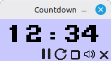
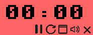
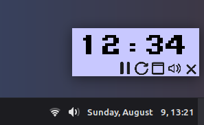

# Countdown

A desktop countdown timer built with Rust and SDL.
<br><br>

<div align="center">

 &nbsp;&nbsp;&nbsp;&nbsp;&nbsp; 
 &nbsp;&nbsp;&nbsp;&nbsp;&nbsp; 


</div>

## Requirements

SDL2 development libraries, including SDL2_image and SDL2_ttf

### Linux (Debian/Ubuntu)

```sh
sudo apt install libsdl2-dev libsdl2-image-dev libsdl2-ttf-dev
```

### Linux (Fedora)

```sh
sudo dnf install SDL2-devel SDL2_image-devel SDL2_ttf-devel
```

### macOS

```sh
brew install sdl2 sdl2_image sdl2_ttf
```

### Windows

Download the MSVC development libraries from [libsdl.org](http://www.libsdl.org/):
1. Download `SDL2-devel-2.0.x-VC.zip`, `SDL2_image-devel-2.0.x-VC.zip`, and `SDL2_ttf-devel-2.0.x-VC.zip`
2. Follow the [rust-sdl2 Windows setup instructions](https://github.com/Rust-SDL2/rust-sdl2#windows) to configure the library paths
3. Copy the DLL files to your project directory or to your PATH

## Build

```sh
cargo build --release
```

## Run

```sh
target/release/Countdown 10
```

The argument is the starting time in minutes between 1 and 99. Defaults to 15 minutes.

Other options:

```sh
target/release/Countdown -x 100 -y 100 -b 5
```

- `-x <pixels>`: window X position
- `-y <pixels>`: window Y position
- `-b`: hide window borders
- `5`: 5 minutes
